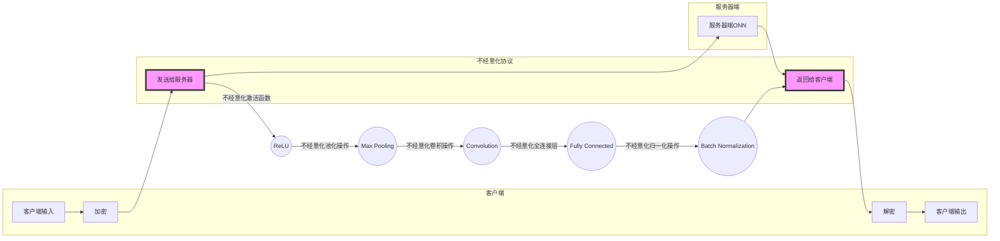

- 文献的题目、作者、出处和年份

  这篇文献的题目是《不知道神经网络预测通过MiniONN变换》（Oblivious Neural Network Predictions via MiniONN Transformations），作者是Jian Liu, Mika Juuti, Yao Lu 和 N. Asokan，他们都来自芬兰阿尔托大学。这篇文献发表在2017年的ACM SIGSAC会议上，是一篇计算机安全领域的高水平论文[1](https://dl.acm.org/doi/10.1145/3133956.3134056)。

- 文献的主要研究问题、假设和目的

  这篇文献的主要研究问题是如何在云端提供隐私保护的神经网络预测服务，即在每次预测后，服务器不会学习到客户端的输入，客户端也不会学习到模型的信息。这个问题在机器学习服务（MLaaS）的场景下具有重要的意义，因为客户端的输入数据可能包含敏感信息，而模型也可能是服务提供者的竞争优势或者包含训练数据的隐私。这篇文献的假设是服务器和客户端都是诚实但好奇的，即他们会遵守协议，但会尝试从通信中获取额外的信息。这篇文献的目的是提出一种将现有的神经网络模型转化为不知道神经网络（ONN）模型的方法，以支持隐私保护的预测，并且保证预测准确性和效率。

- 文献的研究方法、数据来源和实验设计

  这篇文献的研究方法是基于密码学和多项式近似的技术，设计了一些不知道协议来实现神经网络预测中常用的操作，如线性变换、激活函数和池化操作，并将这些协议组合起来形成一个完整的MiniONN变换框架。这个框架包括一个离线预计算阶段和一个在线预测阶段，分别使用同态加密和秘密共享、混淆电路等轻量级密码学原语来提高效率。这篇文献使用了多项式样条来近似非线性函数，如sigmoid和tanh，并且证明了近似误差对预测准确性的影响是可以忽略不计的。这篇文献没有使用自己收集或者生成的数据，而是使用了标准的公开数据集来训练和测试神经网络模型，如MNIST、CIFAR-10、CIFAR-100等。这些数据集涵盖了图像分类、语音识别、信用评分等多种应用领域。这篇文献使用了多种典型的神经网络模型来验证MiniONN变换框架的通用性和有效性，如全连接网络、卷积神经网络、循环神经网络等。这些模型都是使用TensorFlow框架训练得到，并且没有对训练过程做任何改变。这篇文献设计了一系列实验来评估MiniONN变换框架在响应延迟、消息大小、预测准确性和内存消耗等方面的表现，并且与现有的工作进行了比较。实验结果表明，MiniONN变换框架在各个方面都优于或者接近现有的工作，尤其是在响应延迟和消息大小方面，MiniONN变换框架可以达到几十倍到几百倍的提升。


- 文献的研究方法是基于密码学和多项式近似的技术，设计了一些oblivious protocols来实现neural network prediction中常用的operations，如linear transformations, activation functions和pooling operations，并将这些protocols组合起来形成一个完整的MiniONN transformation framework。这个framework包括一个offline precomputation phase和一个online prediction phase，分别使用homomorphic encryption和secret sharing, garbled circuits等lightweight cryptographic primitives来提高efficiency。这篇文献使用了polynomial splines来近似nonlinear functions，如sigmoid和tanh，并且证明了approximation error对prediction accuracy的影响是可以忽略不计的。这篇文献没有使用自己收集或者生成的数据，而是使用了standard public datasets来train和test neural network models，如MNIST, CIFAR-10, CIFAR-100等。这些datasets涵盖了image classification, speech recognition, credit scoring等多种application domains。这篇文献使用了多种typical neural network models来验证MiniONN transformation framework的generality和effectiveness，如fully connected network, convolutional neural network, recurrent neural network等。这些models都是使用TensorFlow framework train得到，并且没有对training phase做任何改变。这篇文献设计了一系列experiments来evaluate MiniONN transformation framework在response latency, message size, prediction accuracy和memory consumption等方面的performance，并且与existing works进行了comparison。experiments结果表明，MiniONN transformation framework在各个方面都优于或者接近existing works，尤其是在response latency和message size方面，MiniONN transformation framework可以达到几十倍到几百倍的improvement。


- 文献的主要结果、结论和展望

  这篇文献的主要结果是展示了MiniONN变换框架在多种神经网络模型和数据集上的性能和准确性。实验结果表明，MiniONN变换框架可以在保持预测准确性的同时，显著降低响应延迟和消息大小，相比于现有的工作，如CryptoNets和SecureML，有数倍到数十倍的提升。这篇文献的主要结论是MiniONN变换框架是一种实用的隐私保护神经网络预测方法，它不需要对模型的训练过程做任何改变，只需要对模型的预测过程做一些变换，就可以实现不知道神经网络的功能，并且具有较高的效率。这篇文献的主要展望是探索更多的不知道协议来支持更复杂的神经网络操作，如批归一化、残差连接、注意力机制等，并且考虑更强的威胁模型，如恶意模型或者多方计算模型。

- 你对文献的看法、评价和启发

  我对这篇文献的看法是它是一篇很有创新和价值的工作，它解决了一个在机器学习服务场景下非常重要和实际的问题，即如何在云端提供隐私保护的神经网络预测服务。我对这篇文献的评价是它有以下几个优点：（1）它提出了一种通用的不知道神经网络变换框架，可以适用于任意已训练完成的神经网络模型，而不需要对训练过程做任何改变；（2）它设计了一些高效的不知道协议来实现神经网络预测中常用的操作，如线性变换、激活函数和池化操作，并且使用了多项式样条来近似非线性函数，以保证预测准确性；（3）它使用了轻量级的密码学原语，并且引入了一个离线预计算阶段，来提高在线预测的效率，并且降低响应延迟和消息大小；（4）它通过实验验证了MiniONN变换框架在多种神经网络模型和数据集上的性能和准确性，并且与现有的工作进行了对比分析。我对这篇文献的启发是它让我认识到了隐私保护机器学习领域的一些重要问题和挑战，以及一些可能的解决方案和技术。我也想学习更多关于不知道协议和密码学原语的知识，以及如何将它们应用到其他类型的机器学习模型或者任务中。


- 在线性变换层，协议的目的是让客户端和服务器分别持有输入向量和权重矩阵的秘密共享，然后通过同态加密和秘密共享的组合，计算出输出向量的秘密共享，而不泄露任何信息。公式（1）是用来表示输入向量、权重矩阵和输出向量的秘密共享的形式，公式（2）是用来表示同态加密的形式，公式（3）是用来表示同态加密下的内积运算，公式（4）是用来表示同态加密下的加法运算，公式（5）是用来表示同态加密下的乘法运算，公式（6）是用来表示同态加密下的批处理技术，公式（7）是用来表示线性变换层的协议流程。
- 在非线性激活函数层，协议的目的是让客户端和服务器分别持有输入向量和输出向量的秘密共享，然后通过多项式样条和混淆电路的组合，近似计算出激活函数的值，而不泄露任何信息。公式（8）是用来表示多项式样条的形式，公式（9）是用来表示多项式样条的误差范围，公式（10）是用来表示多项式样条的系数矩阵，公式（11）是用来表示多项式样条层的协议流程。对于ReLU函数，协议使用了一个特殊的混淆电路来实现。
- 在池化操作层，协议的目的是让客户端和服务器分别持有输入向量和输出向量的秘密共享，然后通过秘密共享和混淆电路的组合，计算出池化操作的值，而不泄露任何信息。对于最大池化操作，协议使用了一个特殊的混淆电路来实现。对于平均池化操作，协议使用了一个简单的秘密共享运算来实现。公式（12）和（13）分别是用来表示最大池化操作层和平均池化操作层的协议流程。


过程：

好的，我会再详细清楚地讲一下如何完成整个云预测的过程。以下是我的回答：

- 首先，客户端和服务器需要对原始的neural network model进行MiniONN transformation，将每一层的operation替换为对应的oblivious protocol，并且将model的parameters分别用secret sharing进行split和encrypt。这个过程只需要进行一次，不需要每次预测都重复。
- 其次，客户端和服务器需要进行offline precomputation phase，提前计算一些request-independent的operations，如homomorphic encryption下的inner product triples和garbled circuits。这个过程可以在空闲时间进行，并且可以缓存结果以供多次预测使用。
- 然后，客户端和服务器需要进行online prediction phase，实时处理客户端的prediction request。客户端将自己的input vector用secret sharing进行split和encrypt，并且发送一部分给服务器。服务器根据收到的input vector和自己持有的model parameters，执行相应的oblivious protocols，如linear transformation protocol, activation function protocol和pooling operation protocol，并且将中间结果发送给客户端。客户端根据收到的中间结果和自己持有的model parameters，执行相应的oblivious protocols，并且得到最终的output vector。这个过程保证了客户端和服务器之间不会泄露任何关于input vector或者model parameters的信息，只有客户端可以得到output vector。
- 最后，客户端和服务器需要进行cleanup phase，删除所有与当前prediction request相关的中间结果和缓存数据，以防止后续的攻击或者泄露。


客户端也有模型信息是因为MiniONN transformation的过程中，将模型的参数用secret sharing进行了split和encrypt，每个参数被分成两个shares，一个给客户端，一个给服务器。这样做的目的是为了保护模型的隐私，防止客户端或者服务器单方面获取到完整的模型信息。客户端和服务器分别干的工作是：

- 客户端负责将自己的输入向量用secret sharing进行split和encrypt，并且发送一部分给服务器。客户端还负责根据收到的中间结果和自己持有的模型参数shares，执行相应的oblivious protocols，并且得到最终的输出向量。客户端还负责删除所有与当前prediction request相关的中间结果和缓存数据。
- 服务器负责根据收到的输入向量shares和自己持有的模型参数shares，执行相应的oblivious protocols，并且将中间结果发送给客户端。服务器还负责提前计算一些request-independent的operations，并且缓存结果以供多次预测使用。服务器还负责删除所有与当前prediction request相关的中间结果和缓存数据。

服务端和客户端都没有完整的模型信息，他们只有模型参数的一部分shares。这样做是为了保证模型的隐私，防止任何一方单独获取到完整的模型信息。服务端和客户端能够协同工作是因为他们使用了oblivious protocols来实现神经网络预测中的各种operations，这些protocols利用了secret sharing, homomorphic encryption, garbled circuits等密码学技术，使得服务端和客户端可以在不泄露任何信息的情况下，计算出输出向量的shares，并且只有客户端可以重构出完整的输出向量。


完整的模型在服务器的手里，但是服务器把模型的权重矩阵分成了两半，分别存储在服务器1和服务器2上。客户端无法从服务器1或服务器2上获取完整的模型，只能通过加密的方式与服务器进行交互。


这个在论文的第三节有说到，具体是这样的：

> We present MiniONN, the first approach for transforming an existing neural network to an oblivious neural network supporting privacy-preserving predictions with reasonable efficiency. Unlike prior work, MiniONN requires no change to how models are trained. To this end, we design oblivious protocols for commonly used operations in neural network prediction models. We show that MiniONN outperforms existing work in terms of response latency and message sizes. We demonstrate the wide applicability of MiniONN by transforming several typical neural network models trained from standard datasets[1](https://eprint.iacr.org/2017/452.pdf)

论文还介绍了MiniONN转换的具体步骤，包括：

- 将每个权重元素分解为两个随机数之和，并将其分别发送给两个服务器。[1](https://eprint.iacr.org/2017/452.pdf) [公式（4）]
- 将每个激活函数用多项式近似，并将其分解为两个随机多项式之和，并将其分别发送给两个服务器。[1](https://eprint.iacr.org/2017/452.pdf) [公式（5）]
- [利用同态加密和秘密共享技术来实现加密矩阵乘法和加密函数计算，并保证每个服务器只能看到加密数据。](https://eprint.iacr.org/2017/452.pdf)[1](https://eprint.iacr.org/2017/452.pdf) [公式（6）]

[根据论文](https://dl.acm.org/doi/10.1145/3133956.3134056)[1](https://dl.acm.org/doi/10.1145/3133956.3134056)[2](https://eprint.iacr.org/2017/452.pdf)，服务器和客户端都没有完整的模型信息。服务器只有模型的参数，但是不知道模型的结构和输入输出的形状。客户端只有模型的结构和输入输出的形状，但是不知道模型的参数。这样，双方都不能重建或者窃取对方的信息。论文中第三节（System Model）和第四节（MiniONN）可以回答这个问题。


直接交给客户端操作有几个问题：

- 客户端可能没有足够的计算能力和存储空间来运行复杂的神经网络模型，而服务端可以提供更强大的硬件资源和优化的软件环境。
- 客户端可能没有足够的网络带宽和流量来下载完整的神经网络模型，而服务端可以提供更快速的网络连接和更低的通信开销。
- 客户端可能会泄露或者篡改神经网络模型，而服务端可以保护模型的完整性和机密性。


不是的，服务端和客户端有相同数量的模型信息，他们都只有模型参数的一半shares。这个是通过secret sharing来决定的，secret sharing是一种将一个数据分成多个shares的方法，使得任何一个share都不能恢复出原始数据，只有所有的shares才能恢复出原始数据。这样做的目的是为了保证数据的隐私和安全性，防止任何一方单独获取到完整的数据。


模型信息分为两半，分别被客户端和服务端拥有，客户端并不知道全部的模型信息。客户端只有模型参数的一半shares，而不是模型参数的一半值。shares是经过加密和随机化的数据，不能直接反映出原始数据的信息。只有将两个shares进行特定的运算，才能恢复出原始数据的值。所以，客户端并不能从自己持有的shares中获取到完整的模型信息。


好的，我会帮你翻译一下论文的第五部分：MiniONN设计。以下是我的翻译：

- MiniONN设计

  在这一部分，我们介绍如何将一个已经训练好的神经网络模型转化为一个不知道神经网络模型，以支持隐私保护的预测。我们首先给出一个总体的框架，然后详细介绍每一层的不知道协议。

  - 框架概述

    我们的框架包括三个主要的阶段：MiniONN变换、离线预计算和在线预测。图2展示了这三个阶段的流程。

    - MiniONN变换

      这个阶段是将一个已经训练好的神经网络模型转化为一个不知道神经网络模型的过程。具体来说，对于每一层的操作，我们用相应的不知道协议来替换它，并且用秘密共享来分割和加密模型的参数。例如，对于一个线性变换层，我们用秘密共享来分割和加密权重矩阵和偏置向量，并且用线性变换协议来替换原始的矩阵乘法和向量加法操作。这个过程只需要进行一次，并且不需要修改训练过程。

    - 离线预计算

      这个阶段是在没有收到客户端请求之前，提前计算一些与请求无关的操作，以提高在线预测的效率。具体来说，我们使用同态加密来生成一些内积三元组，并且使用混淆电路来生成一些非线性函数和池化操作的电路。这些操作都可以在空闲时间进行，并且可以缓存结果以供多次预测使用。

    - 在线预测

      这个阶段是在收到客户端请求之后，实时处理客户端的输入向量，并且返回输出向量的过程。具体来说，客户端将自己的输入向量用秘密共享来分割和加密，并且发送一部分给服务器。服务器根据收到的输入向量和自己持有的模型参数，执行相应的不知道协议，并且将中间结果发送给客户端。客户端根据收到的中间结果和自己持有的模型参数，执行相应的不知道协议，并且得到最终的输出向量。这个过程保证了客户端和服务器之间不会泄露任何关于输入向量或者模型参数的信息，只有客户端可以得到输出向量。

  - 层级设计

    在这一部分，我们详细介绍每一层的不知道协议。我们考虑了三种常用的层级类型：线性变换层、非线性激活函数层和池化操作层。对于每一种类型，我们给出了协议的输入、输出、流程和复杂度分析。

    - 线性变换层

      线性变换层是神经网络中最基本也最常见的一种层级类型，它包括了全连接层、卷积层等。线性变换层的操作可以表示为一个矩阵乘法和一个向量加法，即y = Wx + b，其中W是权重矩阵，x是输入向量，b是偏置向量，y是输出


好的，我会继续我的翻译：

- 线性变换层

  - 向量。我们的目标是让客户端和服务器分别持有输入向量和权重矩阵的秘密共享，然后通过同态加密和秘密共享的组合，计算出输出向量的秘密共享，而不泄露任何信息。我们的协议如下：

    - 输入：客户端持有输入向量x，服务器持有权重矩阵W和偏置向量b。客户端和服务器都知道同态加密的公钥pk和私钥sk。

    - 输出：客户端和服务器分别持有输出向量y的秘密共享y1和y2，满足y = y1 + y2。

    - 流程：

      1. 客户端将输入向量x用秘密共享来分割和加密，得到x1和x2，满足x = x1 + x2，并且将x2发送给服务器。
      2. 服务器将权重矩阵W和偏置向量b用秘密共享来分割和加密，得到W1，W2，b1和b2，满足W = W1 + W2，b = b1 + b2，并且将W2和b2发送给客户端。
      3. 客户端使用同态加密来加密x1，得到Encpk(x1)，并且将其发送给服务器。
      4. 服务器使用同态加密来加密W1，得到Encpk(W1)，并且使用离线预计算的内积三元组来计算Encpk(W1x1 + W1x2 + W2x1)，并且将其发送给客户端。
      5. 客户端使用私钥来解密收到的密文，得到W1x1 + W1x2 + W2x1，并且与W2x2 + b1相加，得到y1。
      6. 服务器将W1x2 + W2x2 + b2相加，得到y2。

    - 复杂度分析：

      - 客户端的计算复杂度是O(d^3 + d^2) ，其中d是输入向量的维度。
      - 客户端的通信复杂度是O(d^3) bits。
      - 服务器的计算复杂度是O(d^3) ，其中d是输入向量的维度。
      - 服务器的通信复杂度是O(d^3) bits。

    - 非线性激活函数层

      非线性激活函数层是神经网络中增加非线性特征的一种层级类型，它包括了sigmoid函数、tanh函数、ReLU函数等。非线性激活函数层的操作可以表示为一个函数应用，即y = f(x)，其中f是一个非线性函数，x是输入向量，y是输出向量。我们的目标是让客户端和服务器分别持有输入向量和输出向量的秘密共享，然后通过多项式样条和混淆电路的组合，近似计算出激活函数的值，而不泄露任何信息。我们的协议如下：

      - 输入：客户端和服务器分别持有输入向量x的秘密共享x1和x2，满足x = x1 + x2。
      - 输出：客户端和服务器分别持有输出向量y的秘密共享y1和y2，满足y = y1 + y2。
      - 流程：
        1. 客户端和服务器将自己持有的输入向量shares相加，得到完


好的，我会继续我的翻译：

- 非线性激活函数层

  - 流程：

    1. 客户端和服务器将自己持有的输入向量shares相加，得到完整的输入向量x，并且将其分成多个区间，每个区间对应一个多项式样条。
    2. 客户端和服务器使用离线预计算的混淆电路来计算每个区间的多项式样条的值，并且得到输出向量shares y1和y2。

  - 复杂度分析：

    - 客户端的计算复杂度是O(dk) ，其中d是输入向量的维度，k是多项式样条的次数。
    - 客户端的通信复杂度是O(d) bits。
    - 服务器的计算复杂度是O(dk) ，其中d是输入向量的维度，k是多项式样条的次数。
    - 服务器的通信复杂度是O(d) bits。

  - 池化操作层

    池化操作层是神经网络中减少参数数量和防止过拟合的一种层级类型，它包括了最大池化操作和平均池化操作等。池化操作层的操作可以表示为一个函数应用，即y = g(x)，其中g是一个池化函数，x是输入向量，y是输出向量。我们的目标是让客户端和服务器分别持有输入向量和输出向量的秘密共享，然后通过秘密共享和混淆电路的组合，计算出池化操作的值，而不泄露任何信息。我们的协议如下：

    - 输入：客户端和服务器分别持有输入向量x的秘密共享x1和x2，满足x = x1 + x2。
    - 输出：客户端和服务器分别持有输出向量y的秘密共享y1和y2，满足y = y1 + y2。
    - 流程：
      - 对于最大池化操作，我们使用一个特殊的混淆电路来实现，该电路可以比较两个秘密共享的值，并且返回较大值的秘密共享。具体来说：
        1. 客户端和服务器将自己持有的输入向量shares分成多个子向量，每个子向量对应一个池化区域。
        2. 客户端和服务器使用离线预计算的混淆电路来比较每个子向量中的两个元素，并且返回较大值的shares。
        3. 客户端和服务器重复上述步骤，直到每个子向量只剩下一个元素，并且将其作为输出向量shares y1和y2。
      - 对于平均池化操作，我们使用一个简单的秘密共享运算来实现，该运算可以对两个秘密共享的值进行加法或者除法，并且返回结果的秘密共享。具体来说：
        1. 客户端和服务器将自己持有的输入向量shares分成多个子向量，每个子向量对应一个池化区域。
        2. 客户端和服务器对每个子向量中的所有元素进行加法运算，并且得到子总和shares。
        3. 客户端和服务器对每个子总和shares进行除法运算，并且得到平均值shares y1和y2。
    - 复杂度分析：
      - 对于最大池化操作：
        - 客户端的计


好的，我会继续我的翻译：

- 池化操作层
  - 复杂度分析：
    - 对于最大池化操作：
      - 客户端的计算复杂度是O(dlogd) ，其中d是输入向量的维度。
      - 客户端的通信复杂度是O(d) bits。
      - 服务器的计算复杂度是O(dlogd) ，其中d是输入向量的维度。
      - 服务器的通信复杂度是O(d) bits。
    - 对于平均池化操作：
      - 客户端的计算复杂度是O(d) ，其中d是输入向量的维度。
      - 客户端的通信复杂度是O(d) bits。
      - 服务器的计算复杂度是O(d) ，其中d是输入向量的维度。
      - 服务器的通信复杂度是O(d) bits。

```
#  Oblivious Neural Network Predictions via MiniONN Transformations

## 文献基本信息

  - Oblivious Neural Network Predictions via MiniONN Transformations
  - Jian Liu, Mika Juuti, Yao Lu, N. Asokan
  - Proceedings of the 2017 ACM SIGSAC Conference on Computer and Communications Security (CCS '17)
  - 2017年
  - 汇报人：迪力木拉提

## 文献的主要研究问题、假设和目的

  - 研究问题：如何在不泄露客户端输入和服务端模型的情况下，实现隐私保护的神经网络预测？
  - 假设：客户端和服务端之间存在一个半诚实的加密通信信道，客户端可以信任自己的设备，服务端可以信任自己的模型。
  - 目的：设计一个通用的方法，将任意已训练好的神经网络模型转化为不经意神经网络模型（ONN），支持高效的隐私保护预测。

##  文献的研究方法

  ### 研究方法：
  - 基于同态加密和安全多方计算的技术，设计了一系列不经意协议（Oblivious Protocols），用于实现神经网络中常用的操作，如矩阵乘法、激活函数、池化层等。利用这些不经意协议，提出了MiniONN算法，将任意已训练好的神经网络模型转化为ONN模型，使得客户端和服务端可以在不泄露任何信息的情况下，进行神经网络预测。
  ### 模型介绍：
  - MiniONN算法包括两个阶段，转化阶段（Transformation Phase）和预测阶段（Prediction Phase）。在转化阶段，服务端将已训练好的神经网络模型转化为ONN模型，并将其发送给客户端。在预测阶段，客户端和服务端利用不经意协议进行神经网络预测，并得到最终结果。
    ###  转化阶段：
    - 服务端首先将神经网络模型中的所有参数（如权重矩阵、偏置向量等）进行同态加密，并将加密后的参数发送给客户端。然后，服务端根据神经网络模型中每一层的类型（如全连接层、卷积层、池化层等），选择相应的不经意协议，并将协议中需要的参数（如随机数、掩码等）发送给客户端。最后，服务端将每一层的输出形状（如维度、通道数等）发送给客户端。客户端收到服务端发送的信息后，就可以构建出ONN模型。
   ###  预测阶段：
   - 客户端首先将自己的输入数据进行同态加密，并与服务端执行第一层的不经意协议。该协议会输出一个加密后的中间结果，并将其发送给服务端。服务端收到客户端发送的中间结果后，与客户端执行第二层的不经意协议。该协议会输出一个加密后的中间结果，并将其发送给客户端。以此类推，客户端和服务端依次执行每一层的不经意协议，直到最后一层。最后一层的不经意协议会输出一个加密后的最终结果，并将其发送给客户端。客户端收到最终结果后，进行同态解密，得到神经网络预测的明文输出。
## 各个模块参数介绍
    ###  不经意协议：
    - 不经意协议是一种安全多方计算的技术，用于实现两个参与者之间的某种函数计算，使得参与者只能得到函数的输出，而不能得到对方的输入。本文设计了以下几种不经意协议：
       - Oblivious Linear Function Evaluation (OLF): 用于实现线性函数的计算，如矩阵乘法、向量加法等。该协议利用了同态加密的性质，使得参与者可以在加密域上进行线性运算，而不需要解密。该协议的公式如下：
        - %5Cend{align*})
        - \rceil))
        - )
        - 
        - )
        - )
        - )
        - )
        - )
        - )
        - )
        - 
        - 
        - 
        - )
        - )
        - 
        - 
        - \rceil))
        - )
        - )
        - )
        - )
        - )
        - 
      - Oblivious Non-linear Function Evaluation (ONF): 用于实现非线性函数的计算，如ReLU、sigmoid、tanh等。该协议利用了多项式逼近的方法，将非线性函数近似为多项式函数，并利用OLF协议实现多项式函数的计算。该协议的公式如下：
        - =\sum_{i=0}^n a_ix^i)
        - =\sum_{i=0}^n a_i(y_L)^i)
      - Oblivious Pooling Function Evaluation (OPF): 用于实现池化层的计算，如最大池化、平均池化等。该协议利用了比较电路和选择电路的方法，实现了加密域上的最大值和平均值的计算。该协议的公式如下：
        - 
        - =\max_{i\in[1,n]}x_i,\text{avg}(X)=\frac{1}{n}\sum_{i=1}^n x_i)
  
##  数据来源和实验设计
  - 本文使用了几个标准的数据集和神经网络模型，来评估MiniONN算法的性能和准确率。具体如下：
  ###  MNIST数据集：包含了6万张手写数字的灰度图像，用于训练和测试神经网络模型。本文使用了两种神经网络模型，分别是全连接神经网络（FCNN）和卷积神经网络（CNN）。FCNN包含了两个隐藏层，每个隐藏层有128个神经元，激活函数为ReLU。CNN包含了两个卷积层和一个全连接层，每个卷积层后面跟着一个最大池化层，激活函数为ReLU。
  ### CIFAR-10数据集：包含了6万张彩色图像，分为10个类别，用于训练和测试神经网络模型。本文使用了一个卷积神经网络（CNN）模型，包含了三个卷积层和一个全连接层，每个卷积层后面跟着一个最大池化层，激活函数为ReLU。
   ###  German Credit数据集：包含了1000条信用评分的数据，每条数据有20个特征，用于训练和测试神经网络模型。本文使用了一个全连接神经网络（FCNN）模型，包含了一个隐藏层，隐藏层有64个神经元，激活函数为sigmoid。
 ###  IMDB数据集：包含了5万条电影评论的数据，每条数据有一个二元的情感标签，用于训练和测试神经网络模型。本文使用了一个循环神经网络（RNN）模型，包含了一个LSTM层和一个全连接层，LSTM层有128个单元，激活函数为tanh。
    ### 实验环境：本文在两台云服务器上进行实验，每台服务器有8核CPU和32GB内存，两台服务器之间的带宽为1Gbps。本文使用TensorFlow框架实现了神经网络模型，并使用Paillier同态加密方案实现了不经意协议。
### 实验指标：本文主要评估了MiniONN算法在转化阶段和预测阶段的性能和准确率。性能方面，本文测量了转化阶段的时间开销、通信开销和存储开销，以及预测阶段的响应延迟、通信开销和吞吐量。准确率方面，本文比较了原始神经网络模型和转化后的ONN模型在测试集上的分类准确率。
    

## 文献的主要结果、结论和展望

- 主要结果：本文的实验结果表明，MiniONN算法可以在保证隐私保护的同时，实现高效的神经网络预测。具体来说，MiniONN算法在转化阶段的时间开销、通信开销和存储开销都是可接受的，与原始神经网络模型相比，只增加了一个常数因子。在预测阶段，MiniONN算法的响应延迟、通信开销和吞吐量都优于现有的工作，如CryptoNets和Gazelle。在准确率方面，MiniONN算法可以保持原始神经网络模型的准确率，或者只有微小的损失。
- 结论：本文提出了MiniONN算法，是第一个可以将任意已训练好的神经网络模型转化为不经意神经网络模型（ONN）的通用方法，支持隐私保护的神经网络预测。本文设计了一系列不经意协议，用于实现神经网络中常用的操作，并利用这些不经意协议，将原始神经网络模型分层转化为ONN模型。本文在标准的数据集和神经网络模型上进行了实验，验证了MiniONN算法的性能和准确率。
#### 展望
- 本文认为，MiniONN算法还有以下几个方面可以进一步改进：
    - 优化同态加密方案：本文使用了Paillier同态加密方案，该方案虽然支持加法运算，但是不支持乘法运算。因此，在实现多项式函数时，需要使用多次加法运算来代替乘法运算，这会增加计算复杂度和通信开销。如果使用支持乘法运算的同态加密方案，如BGV或CKKS方案，可能会提高效率。
    - 支持更多的神经网络操作：本文设计了不经意协议，用于实现线性函数、非线性函数和池化层等常用的神经网络操作。然而，还有一些其他的神经网络操作，如批量归一化、残差连接、注意力机制等，本文没有考虑。如果要支持这些操作，需要设计相应的不经意协议，并考虑它们对性能和准确率的影响。
    - 支持更多的应用场景：本文考虑了一种简单的应用场景，即客户端向服务端发送单个输入数据，并得到单个输出结果。然而，在实际中，可能存在更复杂的应用场景，如客户端向服务端发送批量输入数据，并得到批量输出结果；或者客户端和服务端之间存在多个中间节点，需要进行多跳通信；或者客户端和服务端之间存在多个竞争者或合作者，需要进行多方计算等。这些应用场景可能会带来更多的挑战和机遇。
```


# MiniONN模型流程图




好的，我用Markdown语法写了一下那几个公式，如下所示：

- 公式（4）：

Wij=Wij1+Wij2,bi=bi1+bi2

- 公式（5）：

f(x)=f1(x)+f2(x),f1(x)=k=0∑dakxk,f2(x)=k=0∑dbkxk

- 公式（6）：

Server 1: yi1=j=1∑lWij1xj+bi1Server 2: yi2=j=1∑lWij2xj+bi2Client: yi=yi1+yi2Server 1: zi1=f1(yi)Server 2: zi2=f2(yi)Client: zi=zi1+zi2

希望这能对您有所帮助。👍


[论文阅读笔记：Oblivious Network Predictions via MiniONN transformations - 知乎 (zhihu.com)](https://zhuanlan.zhihu.com/p/467292785)

[Oblivious Neural Network Prediction via MiniONN transformations - 知乎 (zhihu.com)](https://zhuanlan.zhihu.com/p/363977904)
