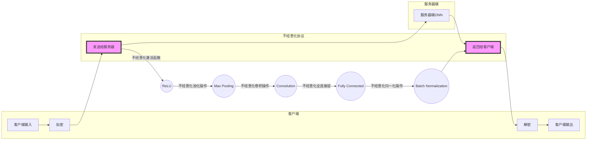

# MiniONN模型流程图

```mermaid
graph LR
A[客户端输入] --> B[加密]
B --> C[发送给服务器]
C --> D[服务器端ONN]
D --> E[返回给客户端]
E --> F[解密]
F --> G[客户端输出]

subgraph 客户端
A
B
F
G
end

subgraph 服务器端
D
end

subgraph 不经意化协议
C
E
end

C -->|不经意化激活函数| D1((ReLU))
D1 -->|不经意化池化操作| D2((Max Pooling))
D2 -->|不经意化卷积操作| D3((Convolution))
D3 -->|不经意化全连接层| D4((Fully Connected))
D4 -->|不经意化归一化操作| D5((Batch Normalization))
D5 --> E

style C fill:#f9f,stroke:#333,stroke-width:4px
style E fill:#f9f,stroke:#333,stroke-width:4px
```